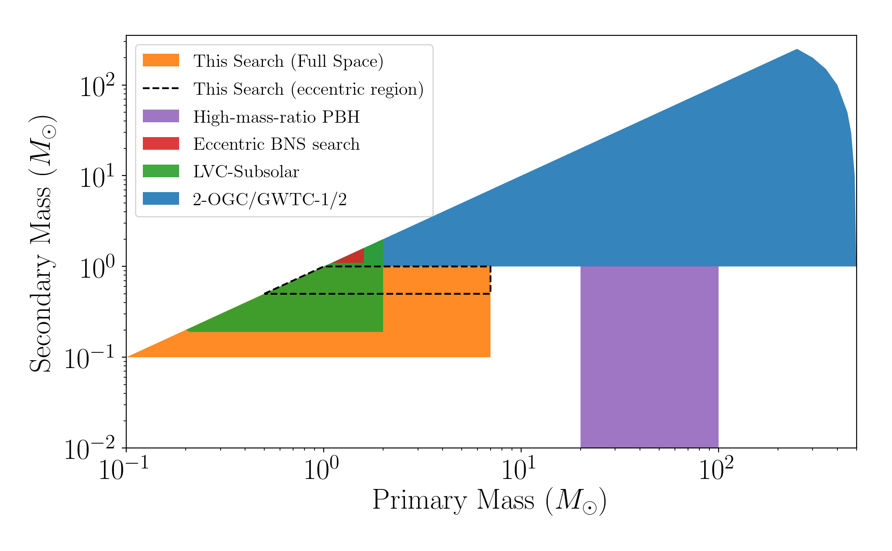

# Search for the coalescence of sub-solar mass and eccentric compact-binary mergers
**Alexander H. Nitz<sup>1, 2</sup>, Yi-Fan Wang<sup>1, 2</sup>**

 <sub>1. [Albert-Einstein-Institut, Max-Planck-Institut for Gravitationsphysik, D-30167 Hannover, Germany](http://www.aei.mpg.de/obs-rel-cos)</sub>
 <sub>2. Leibniz Universitat Hannover, D-30167 Hannover, Germany</sub>

## Introduction ##

We present the first search for gravitational-waves from sub-solar mass compact-binary mergers
which allows for non-negligible orbital eccentricity. Sub-solar mass black holes are a signature of
primordial origin black holes, which may be a component of dark matter. To produce gravitationalwaves binary coalescences, primordial black holes may form close binaries either in the early universe
or more recently through dynamical interactions. A signature of dynamical formation would be the
observation of non-circularized orbits. We search for black hole mergers where the primary mass is
0.1 − 7M and the secondary mass is 0.1 − 1M. We allow for eccentricity up to ∼ 0.3 at a dominantmode gravitational-wave frequency of 10 Hz for binaries with at least one component mass > 0.5M.
We find no convincing candidates in the public LIGO data. The two most promising candidates have
a false alarm rate of 1 per 3 and 4 years, respectively, which combined is only a ∼ 2.4σ deviation
from the expected Poisson rate. Given the marginal statistical significance, we place upper limits on
the rate of sub-solar mass mergers under the assumption of a null observation and compare how these
limits may inform the possible dark matter contribution.


A preprint version of the paper is [available on arxiv](https://arxiv.org/abs/2102.00868).
This release contains configuration files of the search and the template bank used for the analysis.




## License and Citation


This work is licensed under a [Creative Commons Attribution-ShareAlike 3.0 United States License](http://creativecommons.org/licenses/by-sa/3.0/us/).

We encourage use of these data in derivative works. If you use the material provided here, please cite the paper using the reference:

```
@article{Nitz:2021XXX,
    author = "Nitz, Alexander Harvey and Wang, Yi-Fan",
    title = "{Search for the coalescence of sub-solar mass and eccentric compact-binary mergers}",
    eprint = "2102.00868",
    archivePrefix = "arXiv",
    primaryClass = "astro-ph.HE",
    month = "2",
    year = "2021"
}
```

* PyCBC code version (https://github.com/ahnitz/pycbc/tree/hmr)

## Acknowledgments ##
We acknowledge the Max Planck Gesellschaft and the Atlas cluster computing team at AEI Hannover for support. Research supported by Maria de Maeztu Unit of Excellence MDM-2016-0692. This research was supported in part by the National Science Foundation under Grant No. NSF PHY-1748958. This research has made use of data, software and/or web tools obtained from the Gravitational Wave Open Science Center (https://www.gw-openscience.org), a service of LIGO Laboratory, the LIGO Scientific Collaboration and the Virgo Collaboration. LIGO is funded by the U.S. National Science Foundation. Virgo is funded by the French Centre National de Recherche Scientifique (CNRS), the Italian Istituto Nazionale della Fisica Nucleare (INFN) and the Dutch Nikhef, with contributions by Polish and Hungarian institutes.
